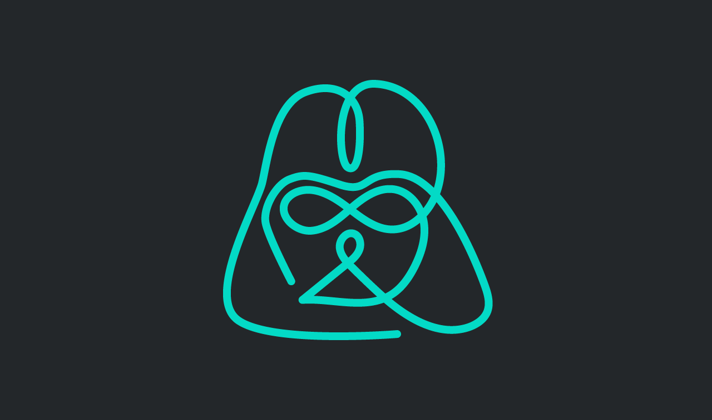
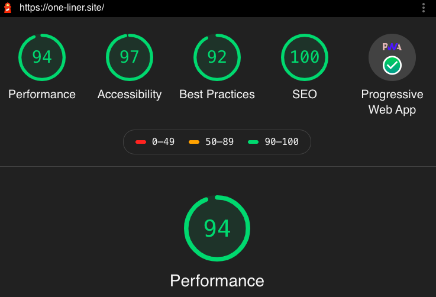
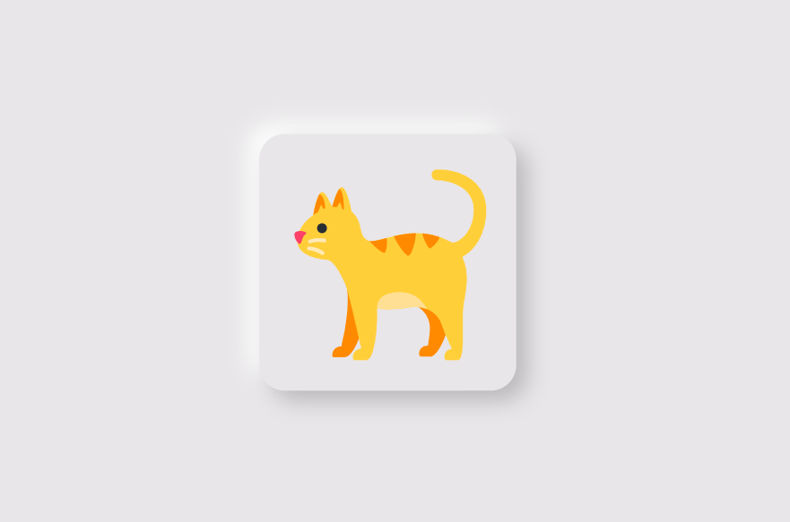
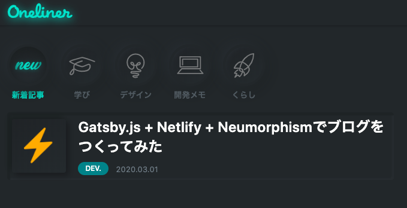

はじめまして、[ベーだー](https://twitter.com/wo_oneliner)です。
駆け出しのデベロッパーで、いまは転職活動中だ。

このブログ・Onelienr（ワンライナー）は、
**Gatsby.js + Netlify + ニューモーフィズムの組み合わせ**でつくった。

初投稿につき、ブログ作成のモチベーションや所感を書いていく。

## 筆者のこれまで

大卒ニート後、ホームレス旅をしたり、マーケティングやデザイン、Web制作の仕事を細々と経験してきた。

昨年末まで、グラフィックとWeb制作に携わるも、会社が超絶ブラックすぎたため病んでしまい退職。

少し心の休息を挟んで、いまは独学でフロントエンドを勉強しつつ、求職活動している。

## モチベーション
このブログをつくった理由はいくつかある。

### デベロッパーとしてのポートフォリオがほしい
Web制作の現場では、Wordpressや簡単なLP制作のみ経験しただけで、フロントエンドのスキルは皆無に近かった。

そこで、2月に入ってからJavascript周りをイチから再学習しはじめた。
今まで敬遠していたReactも触りはじめ、少しずつハマっていった。

転職に向けて、目に見える成果物がほしいため、このブログをポートフォリオの1つとしてつくった。

### Webデザインのリハビリとして
元々、Webデザインがやりたくて制作会社に入ったのだが、グラフィックやディレクション業務に追われ、長らくWebデザインから遠ざかっていた。

ニートなので時間もあるし、どうせなら流行りのデザインをかじってみたくなった。

### 気ままに、なにかを作りたくなった
余談。

（どんな職種でも共通するが）グラフィックやWeb制作のクライアントワークでは、「つくりたくもないものを、つくらされる」ことが苦痛で、前職では特にそれが顕著だった。

そんな毎日を送ってたら、「あれ？自分って何したいんだっけ？」と自失してしまい、病んでしまった。

そんな環境を思い切って抜け出し、心の休息を経てから、**「また何かつくりたいなー」**という気持ちが少しずつ芽生えてきた。

## 技術やデザインのこと

タイトルの通り、[gatsby.js](https://www.gatsbyjs.org/)と[Netlify](https://www.netlify.com/)を利用し、このブログを構築した。

また、デザイン面では、[neumorphism](https://note.com/hironobukimura/n/n0431c73714e8) やダークモードをベースに取り入れてみた。

### Gatsby.js + Netlifyのパフォーマンス

Gatsby.jsは、React製の静的サイトジェネレーターで、GraphQLを用いて、マークダウンから静的なHTMLを生成してくれる。

詳しくは、下記を参照。
[[simple]]
|👉 [Reactの最強フレームワークGatsby.jsの良さを伝えたい！！](https://qiita.com/hppRC/items/00739eaf9ae7fc95c1ca)

また、Netlifyは、Githubなどのソース管理サービスとの連携で、ビルド→デプロイ→ホスティングを担ってくれる。
[[simple]]
|👉 [高機能ホスティングサービスNetlifyについて調べて使ってみた](https://qiita.com/TakahiRoyte/items/b7c4d1581df1a17a93fb)

この2つのサービスの組み合わせにより、**爆速かつSEOにも強いサイトの"ガワ"を、限りなく無料に近い方法でつくることができる。**

[[simple]]
| 🚀余談だが、このブログもドメイン代の70円で構築できた。

また、Reactのコンポーネントベース設計により、カスタマイズ性能も高い。

個人的には、**Wordpressよりも作り込みがカンタンな印象だ**。
一定の学習ハードルを超えると、一気にいろいろと作れてしまう。

Gatsby.js + Netlifyの組み合わせは、ここ2,3年で人気が加速してきたようで、参考になる記事も多い。

気になる方は、ぜひググってみてほしい。

[[simple]]
|👉 [Gatsby.js + Netlify + Githubを使ってJAM Stackなブログを作成・公開する](https://qiita.com/Zabit/items/fdff7b036ce6231ff8db)

### ニューモーフィズム(Neumorphism)でUIを構築

Webデザイン界隈では、**「2020年は、ニューモーフィズム(Neumorphism)が来るぞ！」**と囁かれている、っぽい。

「ニューモーフィズムってなに？」って思った方は、下記を参考に。
[[simple]]
|👉 [Neumorphism: 令和時代のスキューモーフィズム](https://qiita.com/touyoubuntu/items/bf887093ec7265efe201)

ニューモフィズムは、新興のアイディアであり、まだまだ1次情報が少ない。

しかし、[ニューモーフィズム専用のCSSジェネレーター](https://neumorphism.io)のようなサービスも登場しており、アツいトピックの一つになりそうな予感がある。

[[imageMedium]]
| 
私自身、このCSSジェネレ-ターをはじめ、[Dribbble](https://dribbble.com/)、[Behance](https://www.behance.net/search?search=neumorph)、[Codepen](https://tympanus.net/Development/PricingTablesInspiration/)に掲載されているサンプルを活用しながら、このブログのUI設計を行った。

もちろん、**すべてのUIをニューモフィズムで統一したわけではなく、部分的にマテリアルデザインや、フラットデザインの表現も混ぜており、かなり雑食なUIになった**。

[[info]]
| UIについては、かなり悩んだ点も多く、また別記事にて詳しくまとめていく予定。

## おわりに
今後も、UIや内部データを適宜調整しながら、ReactやGatsby.jsを楽しんでいきたい。

また、記事もゆるく更新していきたい。
取り留めのない事柄から、まだインターネットになさそうな1次情報まで、書きたい時に書きたいことを書いていく。

## 謝辞
今回、このブログを作成するにあたり、データ設計・UI設計・マークダウン表現の大部分は、[CatNose](https://twitter.com/catnose99?ref_src=twsrc%5Egoogle%7Ctwcamp%5Eserp%7Ctwgr%5Eauthor)氏が公開されている公開されているソースコードを大変参考にさせていただきました🙇‍♂️🙇‍

👉 [Cat Knows🐈🐕](https://catnose99.com/)

氏の図解Webマガジン「サルワカ」も、Web制作を独学していた時代からよく読ませてもらっております🙏

👉 [サルワカ🐵](hhttps://saruwakakun.com/)

重ねて感謝申し上げます。
