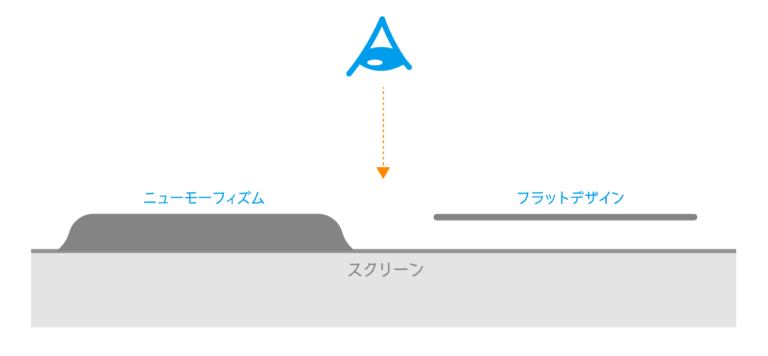

こんにちは、[ベーだー](https://twitter.com/wo_oneliner)です。駆け出しのデベロッパーで、前職ではWebデザインも少し経験してきた。

このブログはGatsby.jsとNetlifyで構築し、UIにはニューモーフィズムのスタイルを取り入れてみた。
[[simple]]
|👉 [Gatsby.js + Netlify & ニューモーフィズムでブログをつくった](https://one-liner.site/hello-world/)

実際にサイトのUIにニューモーフィズムを取り入れたことで、以下のようなメリットが得られたと思う。

1. **少ないコード量で、新鮮な質感を表現できる**

2. **デザインの組み合わせに広がりをもたせてくれる**

---

一方、以下のような点で悩んだ経緯もある。

1. **ダークモードにおける、シャドウの変化の分かりづらさ**

2. **コンポーネントのレイヤーを意識した微調整**

以下、詳しく述べていく。

## ニューモーフィズムのおさらい
[[imageMedium]]
| 引用:https://dribbble.com/shots/7994421-Skeuomorph-Mobile-Banking

ニューモーフィズムは、**「[スキューモーフィズム](https://goodpatch.com/blog/skeuomorphism-and-flat-design/) 」の物理的な質感と、マテリアルデザインのようなシンプルさを組み合わせた新しいUIスタイル**を指す。

語源は、**New（新しい）＋Skeumorphism（スキューモーフィズム）**を組み合わせた造語だ。

### ニューモーフィズムの特徴
[[imageMedium]]
|  引用:https://illustrator-works.com/design/neumorphism/

ニューモーフィズムに関する記事をまとめると、このデザインアイディアのアイデンティティは、以下の2点に集約できる。

1. ボタンやカードなど、**見た目を構成する要素(コンポーネント)が、背景スクリーンとと同じ素材で作られていて、一体となっている**

2. **適切なシャドウを与えることで、凹凸を表現する**

[[simple]]
| つまり、**マテリアルデザインのように、要素が背景と完全に分離し、要素がZ軸方向（奥行き)に浮遊したりすることは、基本的にはない**。

これが、ニューモーフィズムの根本原理と言えそうだ。

## このブログでやりたかった表現
ニューモーフィズムと併せて、やってみたい表現がいくつかあった。

最終的には、ニューモーフィズムと相性の良さそうな要素に絞り込んだ。

- ダークモード
- ネオンっぽい感じ
- Twemojiのインタラクション


[[info]]
| もちろん、**ブログという媒体なので、読者の読みやすさも忘れてはならない。自戒を込めて。**

## ニューモーフィズムをUI実装した所感
<!--  -->
実際に稼働しているウェブサイトで、UIにニューモーフィズムをがっつり採用している物は、まだまだ少ない。

そのため、日本語の記事や、[Dribbble](https://dribbble.com/search/neumorph)・[Behance](https://www.behance.net/featured)・[Codepen](https://codepen.io/search/pens?q=neumorph)でベンチマークになりそうなものを集め、手探りで進めることにした。

そして、実際にUIを作り込む過程で、ニューモーフィズム特有のメリットと問題点を感じたので、問題の解消方法もあわせて提示していく。

[[simple]]
| なお、参考にした記事は、このページの最後にまとめています👇👇👇

### ニューモーフィズムで得られるメリット
ニューモーフィズムを取り入れて得られるメリットは、大きく2つある。

#### 少ないコード量で、質感のある表現が可能


このブログでは、記事ページのヒーローイメージにニューモーフィズムを採用した。

実は、このマテリアルな質感は、わずかなコード量で表現できてしまう。

```css:title=style.scss
.heroImage {
    background: #e7e6e8;
    /* 省略 */
    
    .emoji {
        background: transparent;
        box-shadow:  5px 5px 10px #b9b8ba, 
                    -5px -5px 10px #ffffff;
         /* 省略 */
    }
}
```

**ヒーローイメージと絵文字の背景に同じカラーを指定し、ボックスシャドウで2種類の影を指定するだけ**。

また、影の明度や深度などは、ニューモーフィズムのCSSジェネレーターで簡単に調整できる。いろんなカラーリングで試せるので重宝した。
[[simple]]
| [ニューモーフィズムCSSジェネレーター](https://neumorphism.io/#55b9f3)

CSSの進化とブラウザのサポートで、複雑な表現を簡単にできてしまうのは嬉しい🙏

[[info]]
| 絵文字アイコンの処理については、[ソースコード](https://github.com/hiddy0621/oneliner-gatsby)を覗いてみてほしい。

#### デザインの組み合わせに広がりをもたせてくれる

**他のデザインと組み合わせることで、ニューモーフィズムの特性は活きてくる。**

内容が重複するが、先ほどのヒーローイメージを例にとろう。

**フラットデザインに加え、白背景によるミニマリズム的要素と組み合わせることで、新鮮な質感を演出している**。

ニューモーフィズムは、これまでのWeにおけるデザインアイディアと組み合わせることで、その真価を発揮するはずだ。


### ニューモーフィズムの課題

ニューモーフィズムは簡単なコードで表現できる一方、実装にあたって悩んだ点もある。

#### ダークモードだと影の変化が分かりづらい問題🤔
[[imageMedium]]
|  このブログのトップページにあるカテゴリーボタンの様子。

ニューモーフィズムは、シャドウに適切な変化を与えることで、コンポーネントのリアルな質感を表現する。

しかし、**ダークモードの場合、繊細なシャドウの変化はとても分かりづらい**。

シャドウの変化だけで、コンポーネントの状態変化を示すのには限界がある。

##### 👉 他の要素も変化をさせることで解決！
[[imageMedium]]
|  ボタンだけでなくアイコンにも変化を与える。

この問題は、**他の要素も同時に変化させることで、メリハリをつける**ことで解消できそうだ。

このブログでは、ネオン管のようにアイコンを発光させることで問題を解消した。
[[simple]]
| ネオン管のアイディアは、個人的に好きなアーティスト・[SIRUP](https://sirup.online/wp/)のサイトイメージから着想を得た。


#### コンポーネント同士のレイヤーレベルを意識して微調整しなきゃ問題🤔

[[notice | こだわりたい人向け]]
| この問題は、デザインにこだわりたい人向けなので、興味がなければ読み飛ばしてもオッケー。

マテリアルデザインでもそうだが、**コンポーネント同士のレイヤーレベルを意識し、適切にシャドウを与えることが、現実の質量感を表現することに寄与する**。

これは、ニューモーフィズムでも同様だ。

---
このブログの記事一覧ページを例にとる。


記事一覧のコンポーネントは、凹型タイルをベースに、絵文字アイコンが凸型で飛び出ている構造にした。

断面図はこうなるはず。


このブログのコンポーネントはすべて、光源が左上にある想定で、シャドウを与えている。

そのため、凸コンポーネントと、凹コンポーネントを組み合わせた際には、重なりの隙間にも影ができるはずだ。


しかし、**こういった「現実の物理法則を考慮して、影の濃淡を保管してくれる」ような、ニューモフィズム用のCSSジェネレーターは、まだ登場してない**。

仮に、先述の[ニューモーフィズムCSSジェネレーター](https://neumorphism.io/#55b9f3)を利用しても、単体のコンポーネントのシャドウを生成するのみなので、現実の物理法則とは異なった質感になってしまう。
[[imageMedium]]
| 不自然な影の例。現実の物理法則に比べると不自然。

##### 👉 目視で微調整するしかない
この問題に対しては、**現時点で、目視しながら微調整することしか対策がない**。

時間と手間はかかるが、全体的に統一感を持たせるためには、必要な作業となる。

より高度な補完機能をもつCSSジェネレーターなどが登場すれば、この問題も一気に解消するかもしれないので、天才の登場を待とう...🤔


## まとめ
以上、ニューモーフィズムでUI実装をして得られるメリットと問題点、解消方法などを紹介してきた。

個人的に、**このデザインアイディアは、"今はまだ" 流行りの1つにすぎないかな思う**。

理由は以下の通りだ。

[[simple]]
| **簡単なコードで、パッと見、新しい質感を得られる一方で、ユーザービリティやデザインの統一性を図るためには、適切な補正を加える必要があり、手間がかかるため。**

このような理由からも、現在までWeb上で主流となっているマテリアルデザインやフラットデザインに対して、完全に代替するデザインアイディアではないと感じる。

---

一方、**これまでのWebデザイン技法と組み合わせることで、より新鮮で面白い表現を可能にしてくれるアイディア**でもある。

ニューモーフィズムの優れた実装例が世界中でシェアされたり、より高度なジェネレーターサービスが現れてくるようになると、アイディア自体が洗練されていくはずなので、その動向を楽しみに追っていこう。

### ニューモーフィズムの関連記事
いつもキャッチアップでお世話になっている[colis](https://coliss.com/)や[PhotoshopVIP](https://coliss.com/)などでは、いち早くニューモーフィズムに関してまとめた記事を出している。

👉[最近注目されているニューモーフィズムの繊細なデザインでつくられたフォーム -Neomorphic Form](https://coliss.com/articles/build-websites/operation/css/neomorphic-form-by-swapnet.html)

👉[ニューモーフィズム？CSSコピペ実装できる新Webトレンドの参考HTMLスニペット、ツールまとめ](http://photoshopvip.net/120672)

加えて、IllustratorやFigmaで、ニューモーフィズムのプロトタイプを作成するためのTipsも散見されるようになってきた。

👉[ニューモーフィズムUIボタンをIllustratorでつくってみた。](https://illustrator-works.com/design/neumorphism/)

👉[UIデザインの新しいトレンド「ニューモーフィズム」のデザイン方法と実装方法をやさしく解説](https://coliss.com/articles/build-websites/operation/design/neumorphism-in-user-interface-tutorial.html)

[[simple]]
| また、海外のサイトだと、[Dribbble](https://dribbble.com/search/neumorph)・[Behance](https://www.behance.net/featured)・[Codepen](https://codepen.io/search/pens?q=neumorph)などに、デザイン例やスニペットコードが豊富に共有されている。

ニューモフィズムを実装する際は、ぜひ参考にしてみてほしい。

おわり。